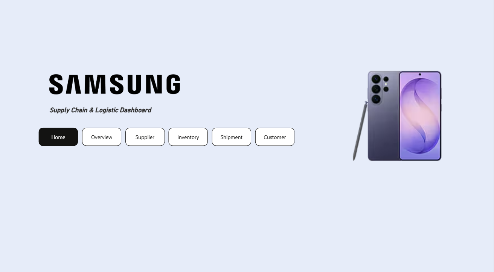
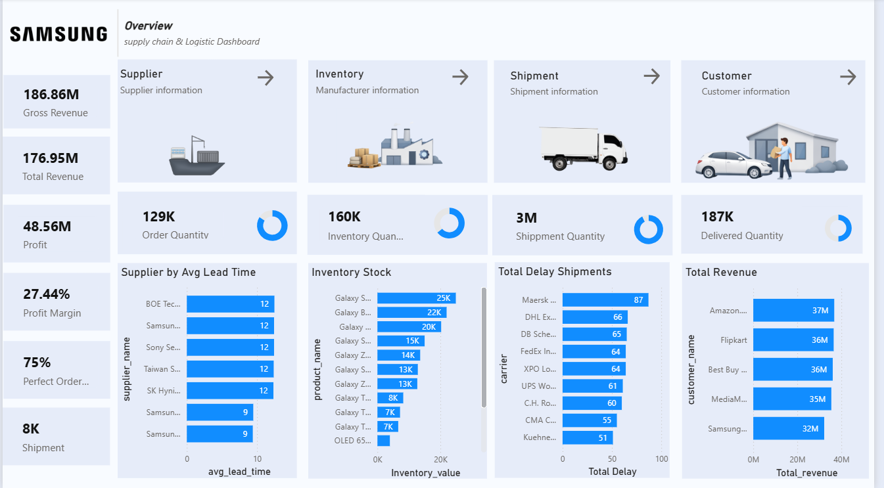
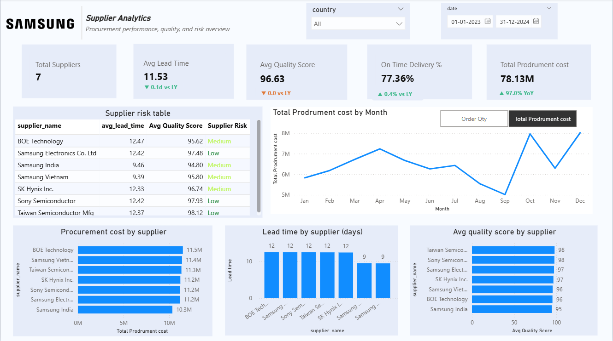
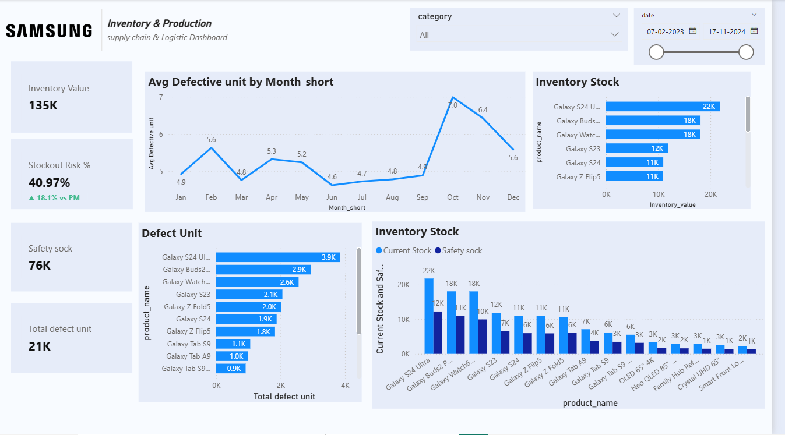
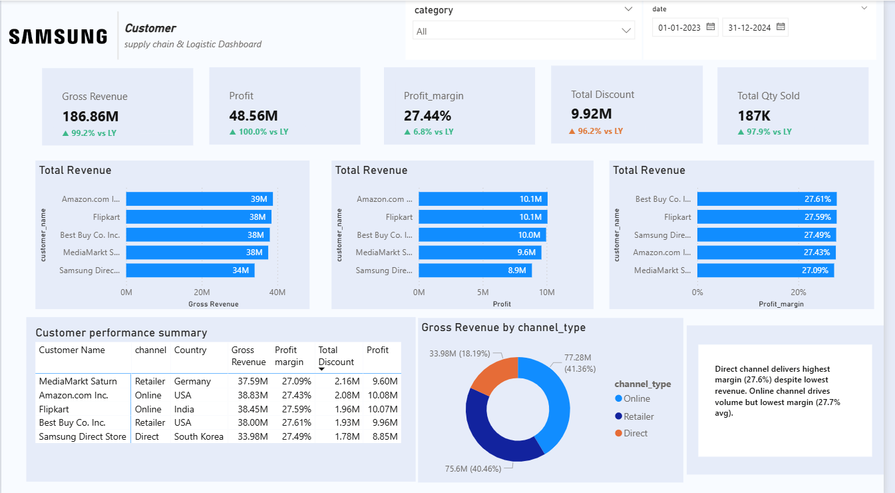

# Samsung Supply Chain & Logistics — Power BI Dashboard

A Power BI case study project modelling a full supply chain operation across 
suppliers, inventory, procurement, production, shipments, and customers.

---

## Data Model

Multi-fact star schema with 5 fact tables and 5 shared dimension tables.

**Fact Tables:**
- fact_sales
- fact_inventory
- fact_procurement
- fact_production
- fact_shipment

**Dimension Tables:**
- dim_product
- dim_date
- dim_customer
- dim_facility
- dim_supplier

The main challenge was enabling accurate cross-filtering across all 5 fact 
tables through shared dimensions without breaking relationships.

---

## DAX Measures

- YoY Revenue Variance
- Supplier Risk Classification (Low / Medium based on lead time and quality score)
- Stockout Risk %
- Profit Margin %
- On-Time Delivery %
- Avg Delivery Days vs Prior Year
- Perfect Order Rate

---

## Report Pages

| Page | Description |
|------|-------------|
| Home | Navigation landing page |
| Overview | High-level KPIs across all supply chain domains |
| Supplier Analytics | Procurement cost, lead time, quality score, supplier risk table |
| Inventory & Production | Stockout risk, defect units, inventory stock by product |
| Customer | Revenue, profit, margin by customer and channel type |

---

## Key Insights (Simulated Data)

- Direct channel delivers the highest margin (27.6%) despite lowest revenue volume
- Stockout risk at 41% — up 18% vs prior month
- Maersk leads total shipment delays at 87, nearly 70% above the lowest carrier
- Gross Revenue: 186.86M | Profit: 48.56M | Profit Margin: 27.44%

---

## Tools & Technologies

- Power BI Desktop
- DAX
- Power Query
- Star Schema / Data Modelling

---

## Screenshots

### Home

### Overview

### Supplier Analytics

### Inventory & Production

### Customer

---

## Notes

This project uses a synthetic dataset designed to simulate realistic supply 
chain scenarios. All modelling and DAX decisions reflect real-world BI 
development practices.

---

## Author

**Aniket Solanki**  
[aniketsol.com](https://aniketsol.com) · [LinkedIn](https://www.linkedin.com/in/aniket-solanki-7618691a6/) · [GitHub](https://github.com/Aniketsol)
